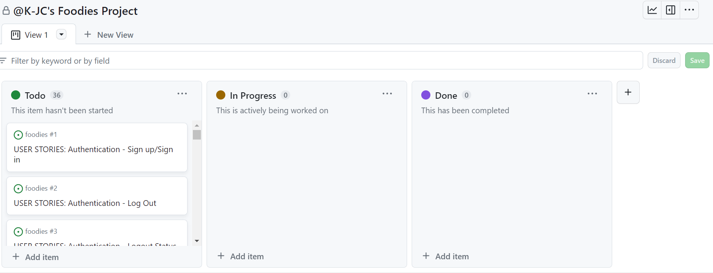

## Foodies
For my fifth and final project with Code Institute I chose to create a baking community based content sharing platform to share baking creations to a global audience. Foodies is all about yummy food, sweet treats and all things good. The platform enables users to create posts, edit or delete posts,read posts,comment and like on posts. Users can also follow other users and keep up to date on their latest creations. Users can use the search bar at the top to browse through the platform's posts. Search results can be filtered on usernames, popularity, date created, title, content keywords and category. This is my advanced front-end project, I hope you enjoy it! - [Link To Foodies](https://drf-foodies-api-1b38deb7eb8c.herokuapp.com/)

Combined Repository - [Repository](https://github.com/K-JC/drf-foodies-api)

## Table of Contents  
* [Development Planes](#development-planes)
* [WireFrame](#wireframe)
* [User Stories](#user-stories)
* [Features](#features)  
* [Testing](#testing)
* [Bugs](#bugs)
* [Validator Testing](#validator-testing)
* [Deployment](#deployment)
* [Credits](#credits)

# Development Planes
## Strategy
I aim to achieve a content sharing platform for all things baking, where users can post images of their creations, they can like and comment on other users posts. A user can also follow another user so they can keep up to date with that user. The post user will have the ability to edit or delete their posts.
When at the first stage of planning my project I put myself in the shoes of the user, I needed to understand what the users wants or needs for this platform. I noted down the following.
Why would the user come here in the first place? To post about their baking creations. To like and comment on other users' creations. To create awareness of their talent to others.
The first thing the user should see is that this is a content sharing platform. It should be very clear how to navigate it for great user experience.
What would make them come back after their first visit? To edit/delete their original post or to make a new post. To check if a user they followed has posted anything new or if there are any comments that they need to reply to.
If the experience of navigating is straightforward, easy to use and the platform looks good this should create a good user experience.
Goal for a user to post their creations to a global network of people
Core Values
A place for users to upload their own post(photos of their baking). A place for users to like or comment on another users post. A user can edit or delete their own posts/comments/images. A user can see all the posts that they have liked. A user can follow another user. A user will have their own profile page/about/profile image(can upload their own image). A user will have login and log out functionality. A new user will be able to sign up for their own account. Will need a react-bootstrap library to aid in the styling and responsiveness of the website. The application will be hosted on heroku. Will connect to a custom API to store our users/posts/likes/comments. User stories to guide me to build functionality . Simple automated tests to check the project works correctly. CRUD functionality for users.

## Scope
The features I want to implement are the ability for a user to create their own account, they can log in and log out with their own username and password which will make their account secure. 
They will be able to personalize their account with an about me section, so that other users can find out more about you. 
They will also be able to upload a profile picture. They can change this at any time. The about me section can also be edited/updated.
They will be able to create a post about their creations, this will include a title, an image and a description relating to the image uploaded. 
They will be able to edit/delete their own posts. Follow/ unfollow other users. Like and comment on other users posts and can comment on their own post in response to other users comments. 

## Structure
Logically grouping the main home page so that additional pages are easy to navigate through a collapsible navigation icon. When a user who isn't signed in/signed up accesses the platform they will only be able to see the “Home,Sign In or Sign Up” navigation links. Only once they are a logged user will they have access to the full navigation links such as “Home, Add Post, Feed, Liked, Sign Out and Profile”.
The user will be able to navigate easily through the platform which will add to a positive user experience. 

## Skeleton
Navigation links and posted content will be presented in a tidy way.
Collapsible navigation links on smaller screen sizes to avoid too much clutter.
Only a logged in user will be able to access the platform fully. There will only be “Home, Sign In and Sign Up navigation links visible to non-signed in users, so it will be clear to the user that to access the site they will need an account and will have to sign up . Once a user is logged in they can access the platform and will now be able to create a post etc. Once posted there will be a drop down to the side of the post with an edit or delete option.
The user will have the ability to log out of their account.
Information on the homepage will be relevant to this sharing content platform, from the description to the imagery used. The Sign In/Sign Up page will have imagery relevant to baking. The favicon/logo used will be related to baking as well, I would like a cake or a mixing bowl. 

## Surface
I want this to look visually pleasing and clean. Google fonts of Noto Serif and a backup of sans-serif. A combinations of different colors (purple) #B8A1BC, #F2C6D0 and #E2D9E3.
A user would visit the platform and see the logo to the left hand side “Foodies” to the right would be all the navigation links. On smaller screen sizes there would be a navigation drop down menu. 
Only the Home, Sign Up and Sign In navigations will be visible to non logged users. Once a user is either signed up/signed in they will see the other navigation links such as “Add Post, Liked, Feed, Sign Out and Profile”.

# Wireframe
Once I had an idea of what the user would need, I could then begin to figure out what the platform would look like.
I created some wireframes using Figma, this is how I envisioned the homepage of the platform to look and the rest of the pages to keep the same visuals.

From the development plane and wireframe I got a good idea of what user stories I create.
I created a GitHub project called Foodies Stories and connected this to my project repository. The user stories are as follows.

# User Stories

 Authentication

* Authentication - Sign up/Sign in - As a site user I can sign up and sign in to the site so that I can access the functionality of the website.
  By using all auth a user can easily sign up or sign into their account.
* Authentication - Log Out -As a site user I can log out of my account so that I have more security over it.
  By using all auth a user can log out of their account which gives them security over their account. 
* Authentication - Logout Status - As a site user I can maintain my logged-in status until I choose to log out so that my user experience is not compromised.
  A logged in user can see their staus in the nav bar by their logged in profile achived by using Django's all auth. 
* Posts -As a site user I cannot edit or delete any posts another user has created so that there is complete protection/control over a user's content.
   By making custom permission so that a user is stopped from making changes to others posts/comments etc.
* Comments- As a site user I cannot edit or delete any comments and likes made that another user has created so that there is complete protection/control over a user’s content.
*  By making custom permission so that a user is stopped from making changes to others posts/comments etc.
* Likes -As a site user I can only like or unlike other users' posts/comments, not my own so that I can show my support for other posts/comments.
  Using the Likes and LikeComments model a user can like a post or like a users comment, by having custom permissions a user can not like their own post or their own comment.
* Following- As a site user I can follow other users so that I can keep up to date with the user’s posts.
  Using the follower model with custom permissions this allows a user to follow another user but stops them from following themself.
* Unfollow - As a site user I can unfollow other users so that I have control over if I want to continue to follow those users anymore.
  
 Navigation
 
* Navigation- As a site user I can see a navigation bar on every page so that I can easily navigate to other pages I wish to visit.
* Navigation Scrolling- As a user I can keep scrolling through the posts on the site that are loaded for me automatically so that my user experience is not compromised.
* Navigation Bar- As a site user I can see the navigation bar is customized to my logged-in or out status so that I can either view all the functionalities available or have limited options. 
* Navigation 404 -As a site user I can see the 404 page so that I am aware I have reached an invalid web page.
* Routing- As a site user I can navigate through pages quickly so that I can view content seamlessly without page refresh.
* Navigation - As a site user I can be notified when my actions are successful so that I know if my actions were successful or not.
  
Post

* View Homepage posts- As a site user I can view all the posts on the Homepage so that I can choose to view/like and comment on any post I'm interested in. 
* View posts details - As a site user I can view details on a post made so that I can see comments made by all the different users of the platform.
* Create posts- As a site user I can create a post so I can share my creations with my community.
  By using the Post model a user can add an image, content, category and a title to their post. A user can see how long ago a post was made. 
* Edit/delete posts- As a site user I can edit/delete my posts so that I can make changes to an existing post title/description or remove my post completely.
 By using generics (RetrieveUpdateDestroyAPIView) in the Post views a users can edit/delete their post.
* View posts Feed- As a site user I can view all user posts made on the Feed page so that I can keep up to date with other users.

* Post Order View- As a site user I can view the most recent posts, ordered by the most recent first so that I am kept up to date with the latest content.
* Search Posts- As a site user I can search for posts/users in a search box so that I can find specific posts/users that I am searching for.
  By using custom filterset feilds and search feilds in the post view a user can search for relevant posts based on title, name and content.
* Content Filters- As a site user I can view content filtered by users I follow so that I can keep up to date with their creations they post about.
* By using custom filterset feilds in the views of post/comment/profile a user can filter information based on what they search.
  
Comment 
* View Comment- As a site user I can view comments on a post so that I can read what others are saying. 
* Post Comment- As a site user I can post a comment on a post so that I can share what I am thinking.
* Edit/Delete Comment- As a site user I can edit/delete my comments so that I have control over what I want to say and either fix or remove my comment.
  By using generics (RetrieveUpdateDestroyAPIView) in the Comment views a users can edit/delete their comment.
* Comment Creation Date- As a site user I can see how long ago a comment was made so that I know how old a comment is.
 By using generics (ListCreateAPIView) in Comment views a user can see a list of comments on a post and by the django import naturaltime A user can see how long ago a comment was made. 

* Comment Likes - As a site user I can like another user's comment so that I can show I support their comment.
  the Comment Likes model enables a users to like another user comment.

Likes  
* Likes- As a site user I can see the number of likes on a post so that I can see which are becoming popular.
  the likes model enables a users to like another user posts.

* Like/Unlike- As a site user I can like/unlike comments so that I can show my support/remove support for a particular post.
  By using generics (RetrieveDestroyAPIView) in the Like views. A users can remove their like on a post.
  
Profile
* Following Users- As a site user I can follow/unfollow other users so that I have control over whether I want to see their content on my feed or not.
  By using the Follow model users can choose to follow or unfollow other users. 
* Popular Profiles- As a site user I can see the most popular profiles so that I can gauge who’s creations are getting noticed more.
* Update Profile About- As a site user I can update my about me so that I can make changes when necessary and other users will keep updated on me.
* Update Profile Picture- As a site user I can update my profile picture so that I can keep my profile up to date.
* View Profiles- As a user I can view another user's profile picture so I can easily identify other users of the platform.
  By using the profile model, a user can view users profile pictures. 
* Update Profile Info- As a site user I can update my username and password so that I can change my display name and keep my profile secure.
* View Other Profiles- As a site user I can view other users' profiles, about me, number of posts, follows and users followed so that I can learn more about them.
  By using the profile views any posts by a user, followers and followed count will show on their profile page.

# Features

# Bugs
During the start of the project when using npm start an error occured in the terminal which was “ code: 'ERR_OSSL_EVP_UNSUPPORTED” so I went to search slack for an answer and it looked like that everytime I wanted to start my app I would need to use “nvm install 16 && nvm use 16”  this would now allow me to start my app, but it was something I need to do every time.
foodies-drf-api profile page error 500, changes were bit migrated to the database, wasnt connected correctly. 
edit profile wasnt loading correctly, my route needed a "/" to the end of the file path. 
The drop down menu for editing posts was not working as expected, after going through my code I had used a capital in PostsPage it should have been lower case to begin with postsPage. Once corrected the drop down menu worked as expected. 
Comment count was not showing, after going through my code it turned out to be a spelling error in my post.js once corrected the number of comments was now showing as expected. 
While trying to implement emoji picker so that a user could add an emoji to their comment I was unable to make this work, after looking through slack and stackoverflow I realised that emojis are universal and will already be in the keyboard for smaller screens like phones and tablets. For desktops you need to press the windows key + and . to open a emoji window and then these can be added into a comment. 
When originoally trying to deploy the back end to heroku the only page I had trouble with was the “profiles” page and an error of 500 was showing. I went back to my code and I did fix an error with my ProfilesList views. I had put the wrong generics in there and should have been generics.ListAPIView. I deployed once more and I then checked the profiles page and the 500 error was no longer showing and the information on the profile was showing.

While originolly trying to deploy my project my api wasnt talking to my front end and I had alot of CORS errors come up in my chrome dev tools console(Cors No Header Origin). After much headache over trying to fix this I had seen that we could combined our reposityrs into one work space which would mean that cors would no longer be an issue as the api was coming from the same workspace/shared base URL. I followed the steps set by code institute to enable my project to contain both front end and back end portions of the project and once all was set up and I deployed my project to heroku it was finally working! 

# Future Features
I would like to impliment more messages to the users when they interact with the site such as You have logged in/logged out successfully.

# Validator Testing
HTML - W3C HTML Validator
CSS - W3C CSS Validator
PEP8 - Python Validator
Eslint Play Validator

# Testing
## Manual Testing 
Manual Testing of the platform was consistant through the development of the project in GitPod. 
All navigation links take me to the correct pages.
Sign in and sign up forms work correctly and that information is shown on the database.
The navigation link for adding a post takes the user to the add a post page where the user can then upload an image create a title, choose a catagory and write a bit about their creation then they can create a post, this will then take the user to the post list page where all posts submitted will be. Only the posts owner can edit or delete their post which they can do by clicking a drop down menu to the right hand side of their post, there is an option to edit a post which works as expected and an option to delete that post, which again works as expected and the post is no longer avalible. 
A user can click on the feed navagation link which will take them to the list of all posts made. The liked navigation link will show the user all the posts they have liked. The profile navagation link will take the logged user to their own profile in which they can edit their username, password, about me and profile image. These all worked as expected. The sign out navagation link signs the user out of their acount and leads them back to a landing page. The foodies logo takes the user back to the feed page. All navigation works as expected though manual testing. Commenting on a post and the comment count work as expected and the like a comment function again works as expected and the number will increase the more likes a comment has. If a comment or a comment like is removed the number also goes down to highlight this. 
Collapsible navigation works on smaller screen sizes and all buttons work  as expected. 

# Testing A Profile
* Logging in as Winter's profile.

* Show Winter's profile page with how many followers, following and posts made so far. On the right hand side can see who she is following in the popular profiles section.

* Show post page for Winter to create a post. Has title, catagory, discription and also upload section for images to upload.

* Once the post has been submitted Winter is sent to the feed page where her newly created post is.

* Clicking on Winter's post, she has a comment and a like from profile user teresa.

* Now Winter can see comments and can react to these comments by liking them.

# Technologies Used
## Frameworks, Libraries, Programs & Applications Used
Django Rest
React.js
Bootstrap.js
Python
PostgreSQL
Cloudinary - I used Cloudinary to store images from this project.
Font Awesome - I used Icons from Font Awesome for my navigation links.
Figma - I used Figma in the planning stage to create my sitemap, from this I created my content sharing platform like I had designed.
GitHub - My project was stored on Github.
GitPod - Gitpod was used for writing my code and when I pushed commits from Gitpod they were uploaded to Github where my project was stored.
Heroku - Where the project was deployed to.
Google Development Tool - Where I checked the responsiveness of the website and edited any code without the risk of making it a permanent change.
Elephantsql - I used Elephantsql for my database.
Canva - For creating my logo/favicon.

## Languages
HTML
CSS
Python
Javascript

# Accessibility
Using Google Development tools, I tested the accessibility of the site via the lighthouse option. My platform scored 

# Setting up 
For the back end I started by using the template provided by code institue to create my repositry. I called this drf_foodies_api. I then began to install the libarys I would need, first “pip3 install ‘django<4’". Once installed I then created my project name by inputting “django-admin startproject drf-foodies-api .” to the terminal. I then proceed to Install Cloudinary Storage by inputting “pip install django-cloudinary-storage==0.3.0”, this will be storage for any images used. And finally I Installed the image processing library known as  Pillow by inputting “pip install Pillow==8.2.0” to the terminal. Now that I had installed some libraries I needed to put these into my settings.py file under INSTALLED APPS portion. I created an env file and made sure that this was also present in my gitignore file. This would keep all the sensitive stuff hidden so it wouldnt be visible on the repositry. 
Next I added my profiles app, I needed to add this to settings.py under installed apps. Python3 manage.py startapp profiles. Every new app I need to install I use this same code but change the app name at the end. 
Time to add the super user so only this user can access the admin panel. Enter “python3 manage.py createsuperuser” to the terminal and create a superuser.
Install Django rest framework, enter “pip3 install djangorestframework”to the terminal and then add this library to installed apps “rest_framework”.
Making sure to migrate any changes to the models and to add librarys to the requirements.txt file.
Later I began on the JSON web tokens I entered “pip install dj-rest-auth==2.1.9 to the terminal.
Then input this to the terminal “pip install 'dj-rest-auth[with_social]” and “pip install djangorestframework-simplejwt”.

# Deployment
DEPLOYMENT PROCESS HEROKU - FRONT END AND BACK END
Back end 
Make sure I have migrated all changes and saved my git pod workspace. 
Log in to elephantsql account and create a new instance. Give the plan a name “drf-foodies-api  free plan" select the region i am in europe-west2 (london). Then review and create the instance. The instance is now on the dashboard. Copy the url for my instance.
Next login to heroku, go to the dashboard, create a new app by clicking on new, new app. Create my unique name for my app, then select my region as europe and click create app. 
Go to settings tab  and open the config vars tab, create a config var key of DATABASE_URL and for the value my database url from elephantsql that i just created. Add CLOUDINARY_URL key with a value of my own cloudinary url. Next DISABLE COLLECTSTATIC with a value of 1. And lastly a key of SECRET_KEY with a value of my chosen secret key that I have made. 
Now go to the deploy tab select the deployment method to github, scroll down till you reach the deploy branch section and click the deploy branch button. Watch the main branch being deployed, this will show any errors with the deployment and will help to identify any issue. I had an issue where my branch was not deploying correctly and this is because I had an error with my allowed_hosts section of my code once I had changed the code and continued to debug it finally was working and the deployment was successful. Once the branch is finished with its building, you can then click on the open app and it should load successfully.

Ended up being a combined deployment, explain proccess...

# Credits

## Media 
All images used are from Pexels, I used Tiny PNG to compress images down and then used Cloudinary as my storage for them.[Pexels](https://www.pexels.com/)
All icons used for my navigation links are from FontAwesome.-[FontAwesome](https://fontawesome.com/)
All icons used for default images are from Icons8.-[Image8](http://icons8.com)
My favicon and logo I created myself from using Canva.-[Canva](https://www.canva.com/)

## Content 
Code Institute - Code inspired and altered from Moments Walkthrough
Code Institute - Code inspired and altered from Django Rest Framework Walkthrough
Code Institute - Code inspired and altered from React Essentials Mini Walkthrough
Alert messages - Code from 
Landing page code inspired and altered from ...

